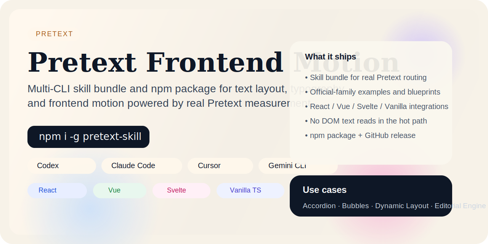

# Pretext Frontend Motion

[](https://www.npmjs.com/package/pretext-skill)
[](https://github.com/Jackson-Loyns/pretext-frontend-motion/blob/main/LICENSE.txt)
[](https://www.npmjs.com/package/pretext-skill)
[](https://github.com/Jackson-Loyns/pretext-frontend-motion/actions/workflows/ci.yml)
[](https://github.com/Jackson-Loyns/pretext-frontend-motion/releases)



Pretext Frontend Motion is a multi-CLI skill bundle and npm CLI for assistants that need measured typography, routed text layout, and motion driven by real Pretext geometry instead of DOM text reads.

It is built on the official work by Cheng Lou:

- Demo site: [https://chenglou.me/pretext/](https://chenglou.me/pretext/)
- Source repository: [https://github.com/chenglou/pretext](https://github.com/chenglou/pretext)
- Runtime package: `@chenglou/pretext`
- Installer package: [`pretext-skill`](https://www.npmjs.com/package/pretext-skill)

## Overview

This repository exists for one reason: when an assistant is asked for text-driven frontend work, it should not fall back to generic landing pages, post-paint DOM measurement, or decorative animation with no structural relationship to text.

The repository combines:

- a published installer CLI for multiple assistants and CLIs
- skill content that routes requests into real Pretext usage
- runnable examples based on the official demo families
- TypeScript integration examples for real projects

## Why It Matters

Most AI-generated frontend output still collapses into:

- generic hero layouts
- DOM text measurement after paint
- animation that has no relationship to text geometry

This project gives assistants a stronger default:

- real Pretext API usage
- official-family examples instead of vague inspiration
- framework integration paths for React, Vue, Svelte, and Vanilla TypeScript
- a published npm installer instead of a repo-only prompt pack

## Quickstart

```bash
npm install -g pretext-skill@0.3.1
pretext-skill init codex --force
```

Then ask for work like:

- "measure text height without DOM reflow"
- "build tight multilingual bubbles"
- "route text around an obstacle"
- "create algorithmic typography motion with real text geometry"

## Install

Recommended:

```bash
npm install -g pretext-skill@0.3.1
pretext-skill init codex --force
```

One-off usage:

```bash
npx pretext-skill@0.3.1 init codex --force
```

Install every supported target:

```bash
pretext-skill init all --force
```

Supported targets:

- Codex
- Claude Code
- Cursor
- Windsurf
- Gemini CLI
- OpenCode
- Continue
- GitHub Copilot
- Roo Code
- Qoder
- Kiro
- Trae
- Antigravity

For command details, see [docs/cli.md](docs/cli.md) and [docs/install.md](docs/install.md).

## When To Use It

Use this bundle when text measurement or text geometry is the real problem:

- predicted text height for accordions, cards, and bubbles
- width-tight multiline UI
- obstacle-aware editorial layout
- canvas-driven kinetic typography
- measured inline flows with chips, links, and text

Do not use it when ordinary DOM flow already solves the problem or when Pretext is only decorative.

See [docs/usage.md](docs/usage.md).

## What You Get

### Skill bundle

The installed bundle teaches assistants to:

- match requests to the correct official demo family
- choose a visual profile instead of defaulting to one aesthetic
- stay in the correct Pretext API lane
- avoid DOM text measurement in resize and interaction hot paths

### Official-family examples

The repository includes examples and blueprints mapped to:

- Accordion
- Bubbles
- Dynamic Layout
- Variable Typographic ASCII
- Editorial Engine
- Justification Comparison
- Rich Text
- Masonry

See [docs/examples.md](docs/examples.md) and [docs/official-demos.md](docs/official-demos.md).

### Real project integrations

The repository also includes TypeScript-first integrations for:

- Vanilla
- React
- Vue
- Svelte

These are framework entry points, not visual demos. They show how to:

- wait for fonts before the first `prepare()`
- keep `prepare()` out of width-driven relayout
- use `layout()` as the cheap path
- integrate Pretext into real framework lifecycle code

See [integrations/README.md](integrations/README.md) and [references/integration-gotchas.md](references/integration-gotchas.md).

## Documentation

Start with these pages:

- [docs/install.md](docs/install.md)
- [docs/usage.md](docs/usage.md)
- [docs/cli.md](docs/cli.md)
- [docs/examples.md](docs/examples.md)
- [docs/official-demos.md](docs/official-demos.md)
- [docs/repository-structure.md](docs/repository-structure.md)
- [integrations/README.md](integrations/README.md)
- [references/integration-gotchas.md](references/integration-gotchas.md)
- [ROADMAP.md](ROADMAP.md)
- [CHANGELOG.md](CHANGELOG.md)
- [SUPPORT.md](SUPPORT.md)

## Validation

Repository checks:

```bash
npm run build
npm test
python3 scripts/validate_skill.py .
npm run check:integrations
```

## Contributing

If you find install failures, recognition problems, generic output, or integration issues, open an issue or pull request with validation notes.

See [CONTRIBUTING.md](CONTRIBUTING.md) and [docs/troubleshooting.md](docs/troubleshooting.md).

## Project Health

The repository includes:

- GitHub Actions CI
- Dependabot for npm and GitHub Actions
- issue and PR templates
- issue template config with support links
- security reporting guidance
- a repository structure guide for contributors
- a public roadmap and changelog
